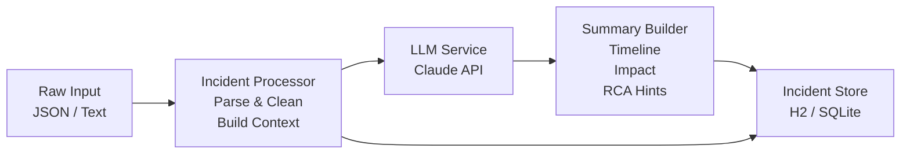

# Incident Summarizer

An AI-powered service that takes raw incident data (alerts, logs, chat messages) and produces structured incident summaries with timelines, impact assessments, and suggested root cause analysis.

## The Problem

After an incident, you're staring at a wall of alerts, Slack messages, and monitoring data trying to piece together what happened, when, and why. Writing a good summary or postmortem timeline is tedious and error-prone.

## What This Project Does

A service that ingests raw incident data and uses an LLM (Anthropic Claude API) to produce:

- **Structured timeline** of events
- **Impact assessment** with severity classification
- **Suggested root cause** analysis
- **Action items** for follow-up

## Architecture



## Tech Stack

| Component        | Technology                    |
|------------------|-------------------------------|
| Language         | Java 25                       |
| Framework        | Spring Boot 3.x               |
| AI Provider      | Anthropic Claude API          |
| Database         | H2 / SQLite                   |
| API Style        | REST (JSON)                   |
| Build Tool       | Gradle                        |
| Frontend (later) | React + TypeScript (optional) |

## Project Milestones

### Week 1 — Hello LLM
Scaffold the Spring Boot project, create a sample hardcoded incident payload, and wire up a basic Claude API call that returns a summary.

**Learning focus:** API integration basics, prompt engineering fundamentals.

### Week 2 — REST API
Build a REST endpoint: `POST /incidents` accepts raw incident JSON and returns a structured summary.

**Learning focus:** Service design, DTOs, request validation.

### Week 3 — Structured Output
Engineer prompts to produce structured output — a timeline, severity rating, and RCA suggestions. Parse the LLM response into typed Java objects.

**Learning focus:** Prompt design patterns, output parsing strategies.

### Week 4 — Persistence
Store incidents and their generated summaries in H2/SQLite. Add a `GET /incidents/{id}` endpoint to retrieve past summaries.

**Learning focus:** Repository pattern, lightweight database integration.

### Week 5 — Multiple Input Formats
Support different input shapes: PagerDuty-style alert JSON, Slack message threads, and raw log lines.

**Learning focus:** Strategy pattern, adapter design pattern.

### Week 6 — Production Hardening
Add error handling, retry logic for LLM API failures, rate limiting, and request validation.

**Learning focus:** Resilience patterns, production-readiness concerns.

### Week 7+ — Stretch Goals
- Simple React/TypeScript frontend
- Slack bot integration for direct thread summarisation
- Webhook ingestion for real-time alert processing
- Multiple Slack message thread → RCA generation

## Getting Started

```bash
# Clone the repository
git clone https://github.com/<your-username>/incident-summarizer.git
cd incident-summarizer

# Set your Anthropic API key
export ANTHROPIC_API_KEY=your-key-here

# Build and run
./gradlew bootRun
```

## Configuration

| Environment Variable | Required | Description                                   |
|-----------------------|----------|-----------------------------------------------|
| `ANTHROPIC_API_KEY`   | Yes      | API key used to authenticate with the Claude API. Read at startup via `anthropic.api-key` in `application.yml`. |

Never commit your API key. Store it in a local `.env` file or export it in your shell — `.env` is already excluded via `.gitignore`.

## Example Usage

```bash
curl -X POST http://localhost:8080/incidents \
  -H "Content-Type: application/json" \
  -d '{
    "source": "pagerduty",
    "title": "High error rate on payment-service",
    "alerts": [
      {
        "timestamp": "2025-03-15T14:32:00Z",
        "severity": "critical",
        "message": "Error rate exceeded 5% threshold on payment-service"
      },
      {
        "timestamp": "2025-03-15T14:33:00Z",
        "severity": "warning",
        "message": "Database connection pool exhausted on payments-db-primary"
      },
      {
        "timestamp": "2025-03-15T14:45:00Z",
        "severity": "info",
        "message": "Auto-scaling triggered for payment-service"
      }
    ]
  }'
```

## License

This project is licensed under the [MIT License](LICENSE).
